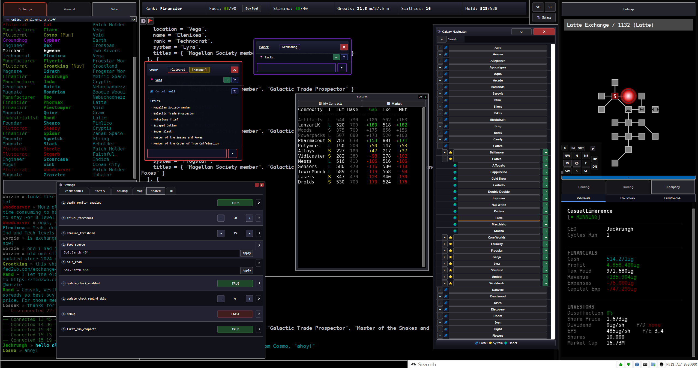

# F2CE-Tools

A Mudlet package for [Federation 2 Community Edition](https://federation2.com) — mapping, navigation, automated trading, factory management, planet-owner tools, and quality-of-life automation, with an optional [Muxlet](https://github.com/tmtocloud/Muxlet)-based GUI.

## Installation

**Recommended: install from in-game.** Log in to F2CE with Mudlet and, the first time the game doesn't see F2CE-Tools installed, it'll prompt you to type `f2t on` — that delivers the package straight from this repo's latest GitHub release to your client automatically, no manual download needed. If you'd rather not be asked, `f2t off` dismisses the prompt (you can still trigger delivery any time by typing `f2t on` yourself).

Alternate install methods, if you'd prefer:

- **Mudlet Package Repository:** run `mpkg install f2ce-tools` in your F2CE profile — Mudlet fetches the latest release directly from the [Mudlet Package Repository](https://github.com/Mudlet/mudlet-package-repository).
- **Manual:** download the latest `f2ce-tools.mpackage` from [Releases](../../releases), then in Mudlet open **Package Manager** and install it into your F2CE profile.

Once installed, `f2t on`/`f2t off` stop talking to the server and instead control whether F2CE-Tools' own Muxlet UI is running (see [Choosing a startup mode](#choosing-a-startup-mode) below) — the in-game delivery prompt only ever appears pre-install.

F2CE-Tools installs [Muxlet](https://github.com/tmtocloud/Muxlet) automatically the first time it loads — Muxlet powers the optional GUI panels below, no separate step needed. Everything else (mapping, hauling, factory tools, etc.) works without it.

### Choosing a startup mode

On first load F2CE-Tools asks how you'd like Muxlet to start. Pick whichever fits how you play — you're not locked in, and every command/alias works the same regardless of mode:

- **Full (recommended)** — loads the ready-made f2ce-tools workspace (output pane and map side by side, plus the panels below) automatically every session. Some panels appear only when they're relevant to you: the Company tab only shows at Industrialist rank and above, its Investment sub-tab only at Financier, the Stockpiles tab only at Founder and above, and the Exchange pane swaps itself to Futures Market depending on your rank and room — all driven by Muxlet's condition/rule engine, no manual toggling needed.
- **Build Your Own Workspace (BYOW)** — Muxlet starts on a blank canvas with every F2CE-Tools panel registered and ready to drop into any pane or tab from its **Content Library**. Same building blocks as Full, but you lay them out yourself — and if you want the same rank- or room-based show/hide behavior Full gets for free, you can wire it up with your own Muxlet condition rules.
- **Minimal** — no changes to your Mudlet layout at all. Run `mux start` any time later (then `mux workspace load f2ce-tools` for the full layout) if you change your mind.

### Staying up to date

F2CE-Tools checks for new production releases on startup by default and offers to install them — this applies regardless of which startup mode you picked above. Pre-release/dev builds are never offered unless you opt in. Both are configurable under **F2CE-Tools › Update** in Settings, along with a "Check for updates now" button.

## Getting Started

Run `f2t` for a full command overview, or `f2t status` to see which components are enabled. Every component also takes its own `help`, e.g. `map help`, `haul help`, `factory help`.

## Features

**Mapping & Navigation** (`map`, `nav`)
Automatic room-by-room mapping as you move, syndicate/cartel/system galaxy topology tracking, saved destinations, speedwalk navigation by name/hash/room ID, planet and system exploration (single room, planet, system, cartel, syndicate, or full galaxy), manual room/exit editing, special exits (arrival commands, circuit travel like trains and shuttles), and map import/export.

**Automated Hauling** (`haul`)
Rank-aware hauling: Armstrong Cuthbert cargo jobs (Commander, Captain), Akaturi contracts (Adventurer), exchange trading that buys low and sells high across a queue of profitable commodities (the ranks the game lets trade on the exchanges: Merchant to Manufacturer, and Founder+; not Financier), and planet supply that fills your planets' deficits and sells their excesses (Founder+). `haul mode` picks what `haul start` runs where a rank has more than one choice (Founder+ can choose planet, deficits only, or exchange), with configurable profit margins and pause behavior.

**Factory Management** (`factory`, `fac`)
Status table for all your factories, one-command flush-to-market, and settings for automatic pre-reset flushing.

**Planet Owner Tools** (`po`)
Exchange economy breakdowns for your planets, filterable by commodity group, and a stockpile manager (`po stockpile`) that plans each commodity's min/max stock and spread from its net production, shows the changes for review, and applies them one confirmed command at a time, on demand or on a timer across a list of your planets.

**Commodities** (`bb`, `bs`, `price`)
Bulk buy/sell at the exchange and cross-cartel price analysis to find the best deals.

**Stamina & Refueling**
Automatic stamina monitoring with food-run automation (or a yes/no prompt in standalone use), and GMCP-driven automatic ship refueling with an emergency out-of-fuel trigger.

**Death Protection**
Tracks your last safe room and halts other automation (hauling, exploration) on death so you don't wake up mid-cycle.

**Chat History** (`f2t chat`)
Persistent, searchable com/tell/say history that survives reconnects.

## Muxlet GUI Panels

With Muxlet installed, F2CE-Tools adds these panels to the Content Library:

- **Galaxy Navigator** — browse every syndicate, cartel, system, and planet; click to travel
- **F2CE Map** — the live Mudlet mapper
- **Company** — overview, factories, financials, and portfolio (Financier+) as separate panes
- **Exchange** — live prices (or futures for Traders/Financiers) with a ticker; hover a price for the cartel's best elsewhere, ▶/★ mark what hauling is trading or would trade, and a commodity name opens it in Commerce > Trading
- **Futures Market** — contracts on offer and your open positions, with profit scoring
- **Commerce** — hauling for every rank, each with the Haul start/pause/stop strip and mode picker:
  - **Jobs** — Armstrong Cuthbert workboard with route distance and effective pay; Commanders and Captains accept, collect and deliver, Industrialists and up post and offer jobs
  - **Akaturi** — the current courier contract and points toward promotion
  - **Trading** — price checks and full price scans across the cartel or, with the Premium Ticker, the galaxy (using whichever of the Remote Price Check Service, its Upgrade and the Premium Ticker you own; with none, the exchange you're in), scored for hauling, plus exchange hauling's live cycle
  - **Planets** — your planets' deficits, excesses, and the planet-supply job queue (Founder+)
- **Commodities** — reference table of names, codes, and base prices
- **Cargo** — live ship manifest
- **Stockpiles** — preview and apply planned stock levels and spreads for your planets' exchanges (Founder+)
- **Player Info** — rank, fuel, stamina, groats, slithies, and hold at a glance
- **Chat** — com/say/tell history with filters and timestamps
- **Who** / **Local Players** — online and in-room player lists

## Scripting F2CE-Tools from another package

Another Mudlet package can drive F2CE-Tools by calling its functions directly and claiming control so the player's own commands don't start a competing automation underneath it. See [docs/SCRIPTING.md](docs/SCRIPTING.md).

## Acknowledgments

- **Colborn (ping65510)** — original creator of F2CE-Tools.
- **Swift ([Ohmi02/Fed2](https://github.com/Ohmi02/Fed2/))** — original idea for the multi-window UI layout (exchange/stats/mapper/chat split panes), later merged into F2CE-Tools.
- **tmtocloud (jackrungh)** — took over maintenance from Colborn, merged in Swift's UI layout, and has since rewritten most of the codebase.
- **Ersella ([ralphcma](https://github.com/ralphcma))** — [Exchange Walker](https://github.com/ralphcma/fed2-exchange-walker-live), whose planning policy the stockpile manager is built on, plus sale-receipt and mapper fixes.

## License

F2CE-Tools is licensed under the [GNU General Public License v2.0 only](LICENSE) from version 3.4.0. Earlier releases were MIT-licensed; see [NOTICE](NOTICE) for the licensing history and third-party attributions.
